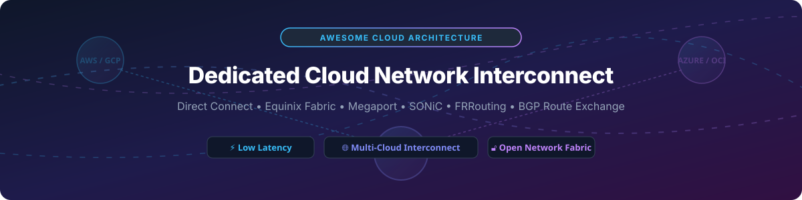

# Awesome-Dedicated-Cloud-Network-Interconnect

# Awesome-Dedicated-Cloud-Network-Interconnect 🔗 🌐

  

  

  

  

  

  

  

---

## 🌟 Top Dedicated Cloud Network Interconnect Ecosystem

**Curated List of Commercial Interconnect Platforms & Open-Source Network Fabric Tools**  

*Focused on Private Cloud Connectivity, Cross-Connect Automation, BGP Route Exchange, Multi-Cloud Fabric & Self-Hosted Network Orchestration*

**Last updated: October 2026** 📅

---

### 📌 Overview & SEO Summary

Welcome to the ultimate curated directory of **dedicated cloud network interconnect platforms**, **open-source network fabric tools**, and **multi-cloud connectivity frameworks**. Whether you are looking for enterprise-grade commercial solutions (such as *AWS Direct Connect*, *Equinix Fabric*, and *Megaport*), or self-hostable open-source alternatives (like *SONiC*, *VyOS*, and *FRRouting*), this list covers category leaders, BGP route exchange, and privacy-respecting private connectivity.

**Key Market Context:**

- **Cloud interconnects bypass the public internet** — delivering **consistent latency, higher throughput, and reduced egress costs** compared to internet-based connectivity.

- **AWS Direct Connect** offers **dedicated connections from 1 Gbps to 100 Gbps**, with **hosted connections at partner locations** for sub-1 Gbps needs.

- **Equinix Fabric** connects to **200+ cloud and network providers** across **250+ data centers in 70+ metros**, making it the **largest neutral interconnect platform**.

---

## 📑 Table of Contents

- [🏢 SaaS & Commercial Platforms](#-saas--commercial-platforms)

- [🔓 Open-Source GitHub Projects](#-open-source-github-projects)

- [🛠️ How to Contribute](#%EF%B8%8F-how-to-contribute)

- [📊 Star History](#-star-history)

- [🤝 Support & Sponsorship](#-support--sponsorship)

- [⚠️ Disclaimer](#%EF%B8%8F-disclaimer)

---

## 🏢 SaaS / Commercial Platforms

The dedicated cloud interconnect market spans **hyperscaler native interconnect services** (Direct Connect, ExpressRoute, Cloud Interconnect) that provide **private connectivity to a single cloud**, **neutral fabric platforms** (Equinix Fabric, Megaport, PacketFabric) that offer **multi-cloud connectivity from a single port**, and **carrier interconnect services** (Lumen, Colt, Telnyx) that integrate **private connectivity with global network reach**. **AWS Direct Connect** charges **$0.30/hour for a 1 Gbps port** plus **$0.02/GB for data transfer out** . **Azure ExpressRoute** charges **$0.05/hour for a 1 Gbps circuit** plus **$0.025/GB for data transfer** . **Google Cloud Interconnect** charges **$0.05/hour for a 10 Gbps attachment** plus **$0.02/GB for egress** . **Megaport** charges **from $100/month for a 1 Gbps port** with **no long-term contracts** .

| SaaS / Commercial Platform | Company / Owner | Valuation / Market Cap | Standard Edition Starting Price | Free Tier / Free Trial Limits | Description |

| :--- | :--- | :--- | :--- | :--- | :--- |

| **[AWS Direct Connect](https://aws.amazon.com/directconnect/)** ☁️ | Amazon | ~$2.0 Trillion | **$0.30/hour** (1 Gbps dedicated) + **$0.02/GB** data transfer  | **No free tier**; demo available | **AWS-native dedicated interconnect** — **Dedicated connections from 1 Gbps to 100 Gbps** . **Hosted connections at partner locations** for sub-1 Gbps . **Private VIF, public VIF, and transit VIF** for flexible routing . **BGP session redundancy** with two connections for high availability . |

| **[Azure ExpressRoute](https://azure.microsoft.com/en-us/products/expressroute/)** 🔷 | Microsoft | ~$3.90 Trillion | **$0.05/hour** (1 Gbps circuit) + **$0.025/GB** data transfer  | **No free tier**; demo available | **Azure-native dedicated interconnect** — **Connectivity from 50 Mbps to 100 Gbps** . **ExpressRoute Direct** for 10/100 Gbps dedicated ports . **ExpressRoute Global Reach** for site-to-site connectivity . **Private peering, Microsoft peering, and public peering** . |

| **[Google Cloud Interconnect](https://cloud.google.com/network-connectivity/docs/interconnect)** 🌐 | Google (Alphabet) | ~$2.0 Trillion | **$0.05/hour** (10 Gbps attachment) + **$0.02/GB** egress  | **$300 free credits** for new customers | **GCP-native dedicated interconnect** — **Dedicated Interconnect** for 10/100 Gbps . **Partner Interconnect** for sub-10 Gbps through service providers . **Cross-Cloud Interconnect** for other cloud providers . **Cloud Router** for dynamic BGP routing . |

| **[Equinix Fabric](https://www.equinix.com/)** 🔵 | Equinix | ~$60 Billion | **$250/month** (1 Gbps port) + cross-connect fees  | **No free tier**; demo available | **The largest neutral interconnect platform** — **200+ cloud and network providers** across **250+ data centers in 70+ metros** . **Virtual connections** to AWS, Azure, GCP, Oracle, and IBM Cloud . **Software-defined interconnection** with **API-driven provisioning** . |

| **[Megaport](https://www.megaport.com/)** 🟣 | Megaport | ~$500 Million | **From $100/month** (1 Gbps port); **no long-term contracts**  | **No free tier**; **free trial available** | **Software-defined interconnection platform** — **Connect to 360+ service providers** across **850+ data centers worldwide** . **Pay-as-you-go pricing** with **no lock-in** . **API and Terraform provider** for automation . **The most flexible interconnect platform** . |

| **[PacketFabric](https://www.packetfabric.com/)** ⚡ | PacketFabric | Private | **From $100/month** (1 Gbps port) | **No free tier**; demo available | **Network-as-a-Service platform** — **Software-defined interconnect** with **API-first provisioning** . **Private and public cloud connectivity** . **SD-WAN and internet exchange** services . |

| **[Lumen Cloud Connect](https://www.lumen.com/)** 🔴 | Lumen Technologies | ~$3 Billion | **Custom enterprise pricing**  | **Demo available** | **Carrier-integrated cloud interconnect** — **Direct connections to AWS, Azure, GCP, and Oracle** . **Global network reach** with **private connectivity** . |

| **[Colt Dedicated Cloud Access](https://www.colt.net/)** 🟢 | Colt Technology Services | Private | **Custom enterprise pricing**  | **Demo available** | **European-focused interconnect** — **Private connectivity to major clouds** . **SDN-enabled provisioning** . |

| **[Console Connect](https://www.consoleconnect.com/)** 🎛️ | PCCW Global | Private | **From $250/month** (1 Gbps port) | **No free tier**; demo available | **Software-defined interconnect platform** — **API-driven provisioning** . **Direct access to cloud providers** . **On-demand bandwidth scaling** . |

| **[Telnyx Cloud Interconnect](https://telnyx.com/)** 📡 | Telnyx | Private | **Custom pricing**  | **Free trial available** | **Cloud interconnect with voice and messaging** — **Private connectivity to AWS, Azure, and GCP** . **Integrated with Telnyx communications platform** . |

---

## 🔓 Open-Source GitHub Projects

*Sorted by GitHub_Stars_Count (Descending)* 🌟

- **[FRRouting (FRR)](https://github.com/FRRouting/frr)**   

  **The most widely deployed open-source routing stack**, GPL-2.0 licensed. **The de facto standard for open-source BGP** — **used by Cumulus Linux, SONiC, and major cloud providers** . **Supports BGP, OSPF, IS-IS, RIP, EIGRP, and PIM** . **Essential for building private cloud interconnects** with **BGP route exchange** . **The foundation of open-source network fabric** . 🛣️

- **[SONiC](https://github.com/sonic-net/SONiC)**   

  **Open-source network operating system for cloud and enterprise**, Apache-2.0 licensed. **The most widely deployed open-source NOS** — **used by Microsoft, Alibaba, and major cloud providers** . **FRRouting-based routing stack** with **BGP** for cloud interconnect . **Open source containerized architecture** . **The foundation for cost-effective cloud interconnect hardware** . 🌐

- **[VyOS](https://github.com/vyos/vyos-build)**   

  **Open-source network operating system with advanced routing**, GPL-2.0 licensed. **BGP and OSPF routing protocols** . **VPN, firewall, and high availability** support . **Cost efficiency** — no licensing fees, enterprise-level features . **The most complete open-source routing platform for building cloud interconnects** . ⚙️

- **[BIRD](https://github.com/BIRD/bird)**   

  **The BIRD Internet Routing Daemon**, GPL-2.0 licensed. **The most widely used open-source BGP daemon** — **used by network operators worldwide** . **Lightweight and efficient** . **Supports BGP, OSPF, RIP, and Babel** . **The standard for BGP route exchange** . 🐦

- **[GoBGP](https://github.com/osrg/gobgp)**   

  **BGP implementation in Go**, Apache-2.0 licensed. **Modern, high-performance BGP** . **API-first design** for automation . **Used for BGP route exchange in cloud interconnects** . **The most developer-friendly BGP implementation** . 🚀

- **[Open vSwitch](https://github.com/openvswitch/ovs)**   

  **Production quality, multilayer virtual switch**, Apache-2.0 licensed. **The standard virtual switch for cloud networking** . **Used by OpenStack, Kubernetes, and major cloud providers** . **OpenFlow and OVSDB support** . **The foundation for virtual network interconnects** . 🔀

- **[Free Range Routing (FRR) Documentation](https://github.com/FRRouting/frr)**   

  **The complete FRR documentation and examples**, GPL-2.0 licensed. **BGP configuration examples for cloud interconnects** . **The standard reference for open-source routing** . 📚

- **[Batfish](https://github.com/batfish/batfish)**   

  **Network configuration analysis and validation**, Apache-2.0 licensed. **Analyzes network configurations for correctness** . **Validates BGP routing policies** . **The standard for network configuration testing** . 🐟

- **[Terraform Provider for Megaport](https://github.com/megaport/terraform-provider-megaport)**   

  **Terraform provider for Megaport**, MPL-2.0 licensed. **Infrastructure-as-code for interconnect provisioning** . **Automate Megaport VXC, MCR, and port creation** . **The standard for automating software-defined interconnects** . 🔧

- **[Terraform Provider for Equinix](https://github.com/equinix/terraform-provider-equinix)**   

  **Terraform provider for Equinix**, MPL-2.0 licensed. **Infrastructure-as-code for Equinix Fabric** . **Automate virtual connections and cross-connects** . **The standard for automating Equinix interconnects** . 🔗

---

## 🛠️ How to Contribute

Contributions are welcome! Follow these steps to submit new interconnect platforms or open-source network fabric software:

1. 🍴 **Fork** the repository.

2. 📝 **Add/edit** entries in `README.md` maintaining table/list structure and formatting.

3. 🔗 Include project title, official website/GitHub link, exact Stars_Count, license, and brief description.

4. 🚀 Submit a **Pull Request** with a descriptive summary of your changes.

---

## 📊 Star History

---

## 🤝 Support & Sponsorship

If you find this dedicated cloud interconnect repository useful, please consider supporting the project:

- ⭐ **Star** this repository to increase visibility!

- 🔀 **Fork** and share with fellow network engineers, cloud architects, and open-source advocates.

- ☕ **Sponsor & Buy Me a Coffee**: Support ongoing open-source curation via the [GitHub Sponsor Dashboard](https://github.com/sponsors/ishandutta2007).

---

## ⚠️ Disclaimer

- This is a **community-curated** list — not exhaustive and not an endorsement. ℹ️

- **Cloud interconnects bypass the public internet** — delivering **consistent latency, higher throughput, and reduced egress costs** . **AWS Direct Connect, Azure ExpressRoute, and Google Cloud Interconnect are hyperscaler-native** — each connects to a single cloud . **Equinix Fabric and Megaport provide multi-cloud connectivity** from a single port .

- **Pricing varies by port speed, commitment, and location** — **AWS Direct Connect at $0.30/hour for 1 Gbps** and **Azure ExpressRoute at $0.05/hour for 1 Gbps** are illustrative . **Data transfer charges apply separately** .

- **Open-source interconnect tools (FRR, SONiC, VyOS, BIRD) are not turnkey** — they require **network engineering expertise, hardware (white box switches or servers), and ongoing maintenance** . **Always validate BGP routing and failover with a proof-of-concept** before production deployment . 🔗

---

  <b>Made with ❤️ for network engineers, cloud architects, and open-source interconnect advocates.</b>

